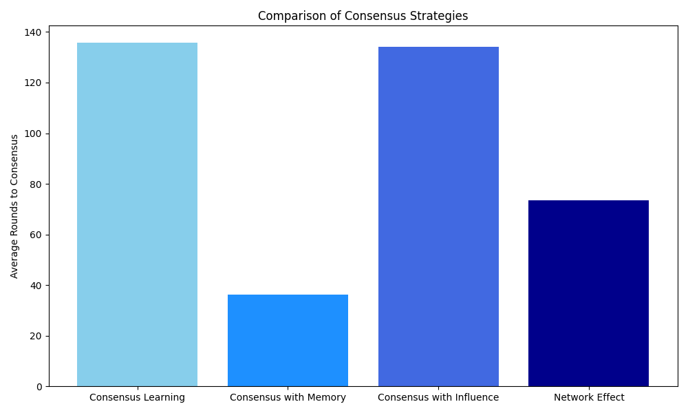

# Poročilo: Implementacija konsenznih algoritmov

## Uvod
V okviru naloge sem implementiral različne algoritme za doseganje konsenza v problemu agentov z modrimi in rdečimi majicami.

## Algoritmi

### Consensus with Influence
Pri algoritmu `consensus_with_influence` sem poskusil implementirati pristop, kjer agenti pridobivajo vpliv glede na čas, ko ohranjajo isto barvo majice. Vpliv agenta se povečuje z vsakim krogom, ko ohrani svojo barvo, kar naj bi pospeševalo doseganje konsenza.

Žal je testiranje pokazalo, da ta algoritem ni učinkovit. Povprečno število krogov za dosego konsenza je celo višje kot pri osnovnem algoritmu `consensus_with_color_count`. Menim, da je to posledica premajhnega vpliva konsistentnosti na odločitve agentov, kar upočasnjuje proces namesto da bi ga pospeševalo.

### Consensus with Network Effect
Uspešnejši je bil algoritem `consensus_with_network_effect`, ki simulira omrežne učinke v družbenih sistemih:

1. **Vplivneži**: 10% agentov je določenih kot "vplivneži", katerih mnenje nosi večjo težo pri srečanjih
2. **Socialna okrepitev**: Ko ena barva postaja prevladujoča, pridobiva dodatni vpliv skozi socialno okrepitev
3. **Mehanizem konformizma**: Po 50 krogih majhen odstotek agentov prevzame barvo večine, kar predstavlja pojav, ko se manjšina začne prilagajati večini pod socialnim pritiskom

Ta pristop modelira točko preloma v družbenih omrežjih, kjer se konsenz hitro oblikuje, ko je dosežena kritična masa.

## Rezultati

## Zaključek
Analiza je pokazala, da so omrežni učinki pomemben faktor pri doseganju hitrega konsenza. Pristop z upoštevanjem vplivnežev in socialnega konformizma je bistveno učinkovitejši od strategij, ki temeljijo zgolj na individualni konsistentnosti.