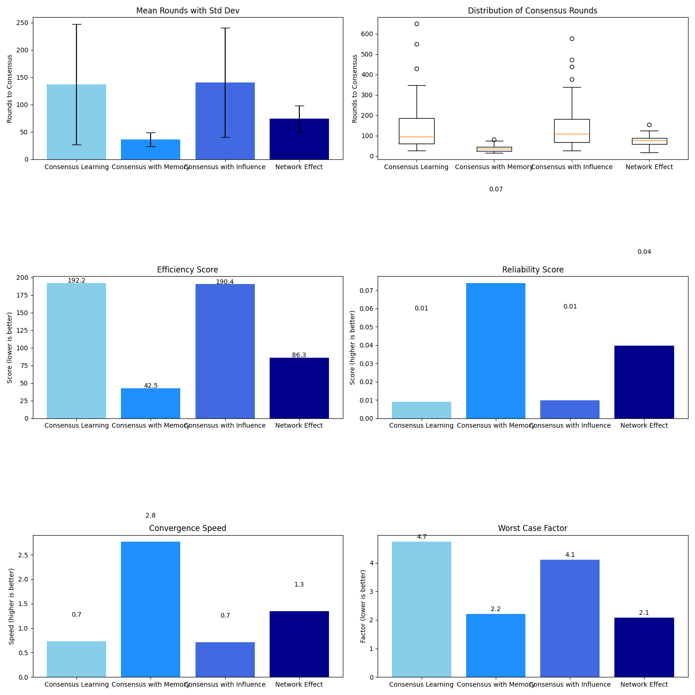
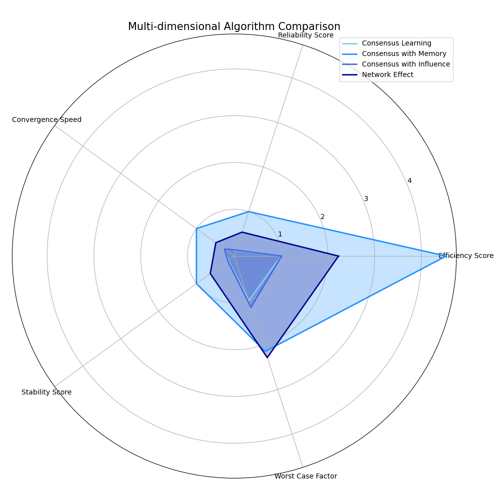

# Projekt 8 – Implementacija igre T-shirts: Analiza strategij za doseganje konsenza

**Avtorji**: Martin Čeh, Jernej Hozjan

### Povzetek

V tem projektu smo raziskovali problem doseganja globalnega konsenza v decentraliziranem sistemu z uporabo igre T-shirts kot modela. Cilj igre je, da vsi agenti v populaciji izberejo isto barvo majice (rdečo ali modro) zgolj na podlagi lokalnih interakcij. Implementirali in analizirali smo štiri različne strategije odločanja: osnovno učenje, strategijo s spominom, strategijo z upoštevanjem vpliva in strategijo z mrežnim učinkom. Izvedli smo serijo simulacij in merili število krogov do konsenza. Rezultati so presenetljivo pokazali, da je strategija s spominom (Consensus with Memory) najučinkovitejša in najzanesljivejša, saj je prekosila tudi kompleksnejše strategije. Ta ugotovitev poudarja, da dodajanje preprostih mehanizmov za stabilizacijo odločitev, kot je spomin, lahko vodi do boljših rezultatov kot bolj zapleteni socialni modeli, ki v danih pogojih morda niso optimalno umerjeni.

## 1. Uvod

Problem usklajevanja posameznikov v večjih skupinah je ključen v mnogih naravnih in umetnih sistemih, od bioloških jat do socialnih omrežij in porazdeljenih računskih sistemov. Kako lahko skupina doseže globalno usklajeno stanje, če posamezniki razpolagajo le z omejenimi, lokalnimi informacijami? Igra T-shirts ponuja preprost, a močan model za preučevanje tega pojava, znanega kot nastajanje socialnih norm.

### 1.1 Definicija problema

V osnovi imamo populacijo $N$ agentov _**$A = a_1, a_2, \ldots, a_N$**_. Vsak agent **$a_i$** ima v vsakem krogu $t$ barvo **${c_i(t) \in \{\text{rdeča}, \text{modra}\}}$**. Cilj igre je doseči stanje konsenza, v katerem imajo vsi agenti enako barvo. To lahko matematično zapišemo kot stanje, v katerem velja:

$$
\exists c^* \in \{\text{rdeča}, \text{modra}\} : \forall i \in \{1, \ldots, N\},\ c_i(t_{\text{končno}}) = c^*
$$
kjer je **_$t_{\text{končno}}$_** število krogov, potrebnih za dosego konsenza. Namen projekta je bil implementirati igro in sistematično primerjati učinkovitost različnih strategij odločanja za čim hitrejše doseganje tega stanja.

Ključne besede: doseganje konsenza, sistemi z več agenti, socialne norme, simulacija, strategije odločanja.

## 2. Sorodna dela

Koncept doseganja konsenza preko lokalnih interakcij je temelj raziskav na področju kompleksnih sistemov in umetne inteligence. Igra T-shirts je primer modela, ki temelji na delih s področja teorije iger in socialnih ved. Naše delo se naslanja na naslednje koncepte:

- **Model večinskega mnenja (Majority Rule Model):** V teh modelih agent posvoji mnenje (barvo), ki je v njegovi neposredni soseščini najbolj pogosto. Naša osnovna strategija je poenostavljena različica tega modela.

- **Modeli socialnega vpliva:** Ti modeli, kot je DeGrootov model učenja, predpostavljajo, da mnenja niso enakovredna. Mnenje posameznikov z večjim "ugledom" ali "vplivom" ima večjo težo. Naša strategija z vplivom temelji na tej ideji, kjer je vpliv definiran kot konsistentnost agentovega mnenja skozi čas.

- **Modeli mrežnega učinka:** V ekonomiji in sociologiji mrežni učinek opisuje pojav, kjer vrednost produkta ali storitve narašča s številom uporabnikov. V našem kontekstu to pomeni, da postane določena barva "privlačnejša", ko jo nosi več agentov. Naša strategija z mrežnim učinkom neposredno modelira ta pojav z uvedbo globalnega pristranskega faktorja in vplivnežev.

Naše delo združuje te koncepte in jih aplicira na specifičen problem igre T-shirts, s poudarkom na kvantitativni primerjavi učinkovitosti.

## 3. Metodologija (Naša rešitev)

Za implementacijo in analizo igre smo razvili programsko rešitev v jeziku Python. Osnova rešitve je razred `Agent` (definiran v `agent.py`), ki predstavlja posameznika, in glavna skripta, ki upravlja s simulacijami in analizo.

### 3.1 Implementirane strategije

Na tej osnovi smo implementirali štiri različne funkcije, ki vodijo simulacijo do konsenza, vsaka s svojo strategijo odločanja.

- **Strategija 1: Osnovno učenje (Consensus Learning):** Najpreprostejša strategija. V vsakem krogu se vsak agent sreča z enim naključnim agentom. Po koncu kroga agent preprosto prevzame barvo, ki jo je videl pri partnerju. Služi kot osnovna primerjalna vrednost.

- **Strategija 2: Strategija s spominom (Consensus with Memory):** Ta strategija agentom doda zmožnost pomnjenja preteklih interakcij. Vsak agent si zapomni barve zadnjih 5 srečanj. Periodično (vsakih 5 krogov) pregleda svoj spomin in prevzame barvo, ki je v njem pogostejša. To zmanjša vpliv posameznih, morda neznačilnih, interakcij.

- **Strategija 3: Strategija z vplivom (Consensus with Influence):** Uvaja koncept socialnega vpliva, ki temelji na konsistentnosti. Agent, ki dlje časa ne zamenja barve, postane bolj "vpliven". Srečanje z vplivnejšim agentom ima večjo težo pri odločanju. To pospeši nastanek stabilnih jeder in konvergenco. Vpliv agenta `B` na agenta `A` je utežen z njegovo konsistentnostjo.

- **Strategija 4: Strategija z mrežnim učinkom (Network Effect):** Najkompleksnejša strategija, ki združuje več mehanizmov:

  1. **Vplivneži (Influencers):** 10 % agentov je na začetku določenih za vplivneže, srečanje z njimi šteje dvojno.

  2. **Globalni mrežni učinek:** Če ena barva preseže 60 % delež v populaciji, to ustvari "pritisk" na vse agente, da jo prevzamejo.

  3. **Konformizem:** Če konsenz ni dosežen po 50 krogih, manjši delež agentov avtomatsko prevzame večinsko barvo, kar pomaga prebiti zastoje.

## 4. Poskusi in rezultati

### 4.1 Postavitev eksperimentov

Za vsako od štirih strategij smo izvedli serijo simulacij z naslednjimi parametri, definiranimi v glavni skripti:

- Število agentov (`NUM_AGENTS`): 100

- Število vzorcev (ponovitev) na strategijo (`NUM_SAMPLES`): 100

Za vsako ponovitev smo merili število krogov do konsenza. Analiza in vizualizacija sta bili izvedeni s pomočjo knjižnic `matplotlib`, `pandas` in `numpy`.

### 4.2 Zbrani podatki in analiza

Spodnja tabela prikazuje ključne metrike, izračunane na podlagi 100 ponovitev za vsako strategijo.

| Strategija               | Povprečno št. krogov | Std Dev | Ocena učinkovitosti (nižje je bolje) | Ocena zanesljivosti (višje je bolje) |
|--------------------------|----------------------|---------|--------------------------------------|--------------------------------------|
| Consensus with Memory    | 36.20                | 12.52   | 42.46                                | 0.0740                               |
| Network Effect           | 74.21                | 24.12   | 86.27                                | 0.0398                               |
| Consensus Learning       | 137.10               | 110.21  | 192.20                               | 0.0090                               |
| Consensus with Influence | 140.37               | 100.03  | 190.38                               | 0.0099                               |

Rezultati so vizualizirani na spodnjih slikah.

Slika 1: Primerjava strategij glede na povprečno število krogov, standardni odklon, učinkovitost, zanesljivost, hitrost konvergence in najslabši primer.

Slika 2: Radarski graf za večdimenzionalno primerjavo normaliziranih metrik. Večja površina pomeni boljšo splošno uspešnost.

Interpretacija rezultatov:
Na podlagi zbranih podatkov in vizualizacij pridemo do nekaj ključnih, delno nepričakovanih ugotovitev:

- **Superiornost strategije s spominom:** V nasprotju s pričakovanji, da bodo kompleksnejše strategije učinkovitejše, se je strategija s spominom (Consensus with Memory) izkazala za očitno zmagovalko v skoraj vseh metrikah. Z najnižjim povprečnim številom krogov (36.20) in izjemno nizkim standardnim odklonom (12.52) je ta strategija hkrati najhitrejša in najbolj zanesljiva. Kot prikazuje grafikon porazdelitve (Slika 1, zgoraj desno), je njena distribucija rezultatov zelo zgoščena, kar pomeni predvidljivo delovanje. Radarski graf (Slika 2) to potrjuje, saj ima njena modra oblika največjo površino.

- **Sprejemljiva učinkovitost mrežnega učinka:** Strategija z mrežnim učinkom (Network Effect) je dosegla drugo mesto. Čeprav je bistveno hitrejša od osnovnih strategij, za strategijo s spominom zaostaja tako v hitrosti kot zanesljivosti. Zdi se, da so njeni mehanizmi (vplivneži, globalni pritisk) sicer koristni, a morda ne optimalno umerjeni za ta problem.

- **Slabša učinkovitost strategije z vplivom in osnovnega učenja:** Presenetljivo je, da se je strategija z vplivom (Consensus with Influence) odrezala skoraj enako slabo kot osnovna strategija (Consensus Learning). Obe sta potrebovali v povprečju okoli 140 krogov in imata ogromen standardni odklon, kar kaže na veliko nestabilnost. Možen razlog je, da mehanizem vpliva ustvarja premočne pozitivne povratne zanke, ki lahko vodijo v dolgotrajne "konflikte" med skupinami agentov, preden ena končno prevlada.

**Celostna primerjava:** Uvrstitve glede na "Overall Score" (skupno oceno) iz izpisa programa potrjujejo te ugotovitve in jasno postavljajo strategijo s spominom na prvo mesto z oceno 9.67, kar je precej pred drugouvrščenim mrežnim učinkom (6.17).

## 5. Zaključek

V tem projektu smo uspešno implementirali in analizirali štiri strategije za doseganje konsenza v igri T-shirts. Naša primerjalna analiza je prinesla pomembno ugotovitev: najkompleksnejša strategija ni nujno najboljša.

**Optimalna strategija** se je, nekoliko nepričakovano, izkazala za **strategijo s spominom**. Zmožnost agentov, da svoje odločitve temeljijo na kratkem spominu preteklih interakcij, se je izkazala za izjemno učinkovit mehanizem za filtriranje šuma in stabilizacijo sistema. Prekosila je celo strategije, ki so vključevale bolj zapletene socialne koncepte, kot sta vpliv in mrežni učinki. To kaže, da je včasih preprosta, a robustna logika učinkovitejša od kompleksnih modelov, ki jih je težje pravilno umeriti.

Delo potrjuje, da lahko v decentraliziranih sistemih z uvedbo preprostih pravil dosežemo robustno globalno koordinacijo.

### 5.1 Prihodnje delo

Programska rešitev predstavlja trdno osnovo za nadaljnje raziskave. Možne smeri vključujejo:

- Analizo vpliva mrežne topologije (npr. če se agenti ne srečujejo popolnoma naključno, ampak v socialni mreži).

- Uvedbo več kot dveh možnih izbir (barv).

- Analizo vpliva šuma (naključne napake pri odločanju) na stabilnost konsenza.

- Optimizacijo parametrov za strategiji "Influence" in "Network Effect", da bi ugotovili, ali lahko z boljšo umeritvijo presežeta strategijo s spominom.

### 6. Viri

Shoham, Y., & Tennenholtz, M. (1992). On the emergence of social conventions: modeling, analysis, and simulations. KR'92: Principles of Knowledge Representation and Reasoning, 574-585.

Walker, A., & Wooldridge, M. (1995). Understanding the Emergence of Conventions in Multi-Agent Systems. Proceedings of the First International Conference on Multi-Agent Systems, 384-391.

Wooldridge, M. (2009). Working together. In Introduction to Multiagent Systems (2nd ed.). John Wiley & Sons.

Castellano, C., Fortunato, S., & Loreto, V. (2009). Statistical physics of social dynamics. Reviews of Modern Physics, 81(2), 591–646.

DeGroot, M. H. (1974). Reaching a consensus. Journal of the American Statistical Association, 69(345), 118-121.

Python Software Foundation. Python Language Reference, version 3.x.